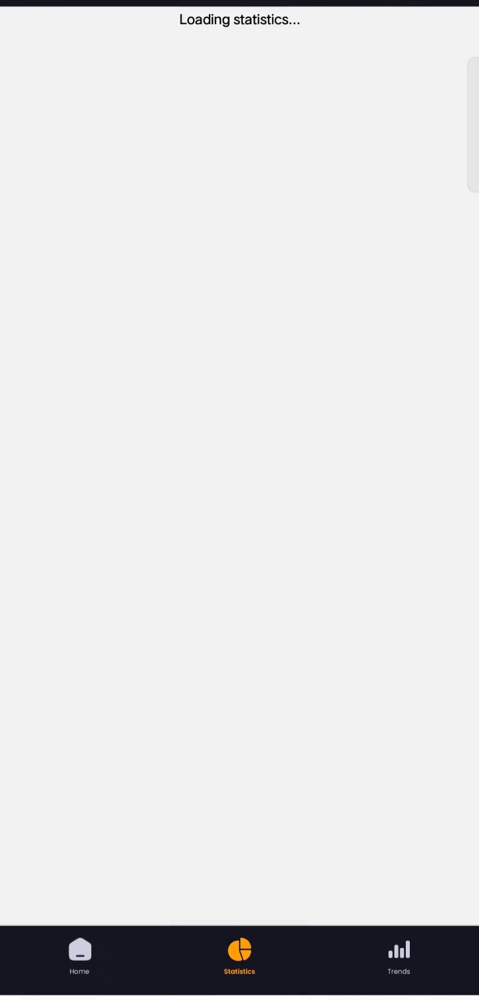

# 🚀 Clarifi

Clarifi is a full-stack web application developed as part of my first-year M.Sc. Scientific Computing project at the Department of Scientific Computing, Modelling and Simulation, SPPU during the period January 2025 to April 2025. It leverages FastAPI for a performant backend and React.js (with Expo) for an intuitive frontend. The application simplifies financial insights by parsing bank statements, categorizing transactions, and presenting interactive charts — all with zero manual effort.

---

## 🧩 The Problem

- ❌ No clear view of monthly spending  
- 📄 Bank statements are dense and inconsistent  
- 🕒 Manual review takes time and effort  

---

## 💡 The Solution

Clarifi:
- 🧠 Reads your bank statement
- 🔍 Understands your transactions across formats
- 📊 Clearly shows where your money goes — no effort needed

---

## 🔄 Workflow

### 📄 User Uploads Bank Statement
- Upload PDF via frontend
- Detect appropriate parser (e.g., ICICI, HDF)
- Convert PDF to DataFrame (via **Tabula**)
- Clean and save extracted data to `extracted_tables/`

### 📊 Processing Statistics
- Convert amounts to numbers
- Categorize transactions
- Label as essential/non-essential
- Group by category and spending type
- Compute totals, ratios, and summaries

### 📱 Displaying Statistics
- Pie Chart: Spending by category
- Bar Chart: Essential vs. Non-Essential
- Built using **react-native-chart-kit**

### 📈 Processing Weekly Trends
- Format dates to datetime
- Label transactions by week
- Group by week and return summarized records

### 📲 Visualizing Weekly Trends
- Line Chart: Green for Deposits, Red for Withdrawals
- Built with **react-native-chart-kit**

---

## 📁 Project Structure

```
.
├── backend/
│   ├── app/
│   │   ├── data/
│   │   ├── extracted_tables/
│   │   ├── uploaded_pdfs/
│   ├── backend/
│   │   ├── parsers/
│   │   │   ├── hdf_parser.py
│   │   │   ├── isic_parser.py
│   │   ├── routes/
│   │   │   ├── stat.py
│   │   │   ├── upload.py
│   │   ├── schemas/
│   │   │   ├── user_schema.py
│   │   ├── utils/
│   │   │   ├── categorizer.py
│   │   │   ├── cleaning.py
│   │   │   ├── tabular_utils.py
│   │   ├── main.py
│   │   ├── database.py
│   │   └── models.py
│   └── requirements.txt
│
├── my-expo-app/
│   ├── app/
│   ├── assets/
│   ├── components/
│   │   ├── CustomButton.tsx
│   │   ├── FormField.tsx
│   ├── constants/
│   ├── icons/
│   ├── images/
│   ├── utils/
│   ├── index.tsx
│   ├── app.json
│   └── tsconfig.json
```

---

## 🛠️ Setup Instructions

### 1. Clone the Repository
```bash
git clone https://github.com/your-username/clarifi.git
cd clarifi
```

### 2. Backend Setup (FastAPI)

```bash
cd backend
python -m venv venv
source venv/bin/activate  # On Windows: venv\Scripts\activate
pip install -r requirements.txt
uvicorn backend.main:app --reload
```

### 3. Frontend Setup (React Native with Expo)

```bash
cd my-expo-app
npm install
npm start
```

---

## 📹 Demo

Short walkthrough of Clarifi’s features:




---

## 📦 API Endpoints

| Method | Endpoint          | Description              |
|--------|-------------------|--------------------------|
| POST   | `/upload/pdf`     | Upload a PDF file        |
| POST   | `/upload/hdf`     | Upload HDF file          |
| GET    | `/stats`          | Get processed statistics |
| POST   | `/user/data`      | Submit user info         |

---

## ✅ TODOs / Future Work
1. Multi-bank Support & Smart Merging
2. Custom Categories & Tagging
3. Expense Prediction with AI
4. Bank Login Integration

---

